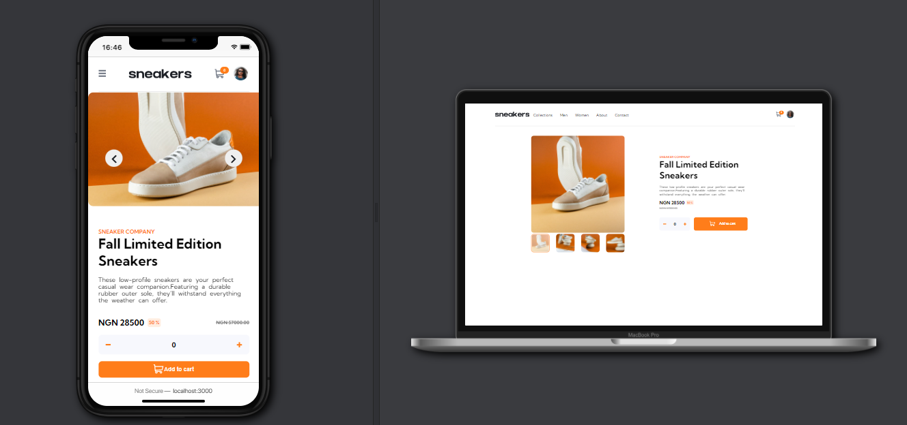

# Frontend Mentor - E-commerce product page solution

This is a solution to the [E-commerce product page challenge on Frontend Mentor](https://www.frontendmentor.io/challenges/ecommerce-product-page-UPsZ9MJp6). Frontend Mentor challenges help you improve your coding skills by building realistic projects.

## Table of contents

- [Overview](#overview)
  - [The challenge](#the-challenge)
  - [Screenshot](#screenshot)
  - [Links](#links)
- [My process](#my-process)
  - [Built with](#built-with)
  - [What I learned](#what-i-learned)
  - [Continued development](#continued-development)
  - [Useful resources](#useful-resources)
- [Author](#author)
- [Acknowledgments](#acknowledgments)

## Overview

### The challenge

Users should be able to:

- View the optimal layout for the site depending on their device's screen size
- See hover states for all interactive elements on the page
- Open a lightbox gallery by clicking on the large product image
- Switch the large product image by clicking on the small thumbnail images
- Add items to the cart
- View the cart and remove items from it

### Screenshot

### Links

- Live Site URL: [Add live site URL here](https://your-live-site-url.com)

## My process

### Built with

- CSS custom properties
- Flexbox
- CSS Grid
- Mobile-first workflow
- [React](https://reactjs.org/) - JS library

### Useful resources

- [React course by Maximilian Schwarzmüller](https://www.udemy.com/course/react-the-complete-guide-incl-redux/?couponCode=D_0722) - This helped me to implement the cart logic

## Author

- Website - [Agboola Vincent](#)
- Frontend Mentor - [@Vinnie-tec](https://www.frontendmentor.io/profile/Vinnie-tec)
- Twitter - [@VinnieOlamide](https://www.twitter.com/vinnieOlamide)
- Linkedin - [@agboola-vincent](https://www.linkedin.com/in/agboola-vincent)
